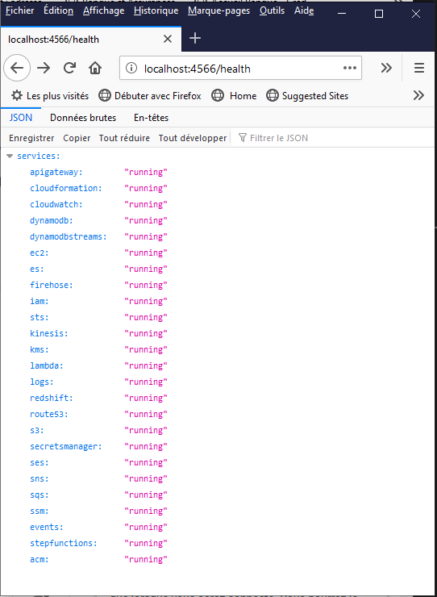

# Build my dockerized AWS Localstack <!-- omit in toc -->

## Sommaire <!-- omit in toc -->

- [1. Create docker-compose file](#1-create-docker-compose-file)
- [2. Set environment and start container](#2-set-environment-and-start-container)
  - [2.1. Set .env file](#21-set-env-file)
  - [2.2. Start AWS localstack container](#22-start-aws-localstack-container)
  - [2.3. Check services status](#23-check-services-status)
- [3. Using SNS and SQS services from AWS CLI](#3-using-sns-and-sqs-services-from-aws-cli)
  - [3.1. Create an SNS Topic](#31-create-an-sns-topic)
  - [3.2. List all SNS Topics](#32-list-all-sns-topics)
  - [3.3. Create an SQS Queue](#33-create-an-sqs-queue)
  - [3.4. List all SQS Queues](#34-list-all-sqs-queues)
  - [3.5. Create an SNS subscription for SQS Queue endpoint](#35-create-an-sns-subscription-for-sqs-queue-endpoint)
  - [3.6. List all SNS subscriptions](#36-list-all-sns-subscriptions)
  - [3.7. Publish a message to an SNS topic](#37-publish-a-message-to-an-sns-topic)
  - [3.8. Check message received in SQS Queue endpoint](#38-check-message-received-in-sqs-queue-endpoint)

## 1. Create docker-compose file

First i have to write docker-compose file from localstack repository
[localstack repository](https://github.com/localstack/localstack).

## 2. Set environment and start container

### 2.1. Set .env file

Write an .env file to set AWS localstack services to boot in environment variables and start docker container.
It is a more common way in order to set environment variables with [docker-compose](https://docs.docker.com/compose/environment-variables/#the-env-file).

### 2.2. Start AWS localstack container

        docker-compose up

*Results observed after starting up container*

### 2.3. Check services status

*Verify that our services are up by browsing url [http://localhost:4566/health](http://localhost:4566/health)*

## 3. Using SNS and SQS services from AWS CLI

### 3.1. Create an SNS Topic

Command Input:

        PS D:\git_projects\aws-localstack> aws --endpoint-url=http://localhost:4566 sns create-topic --name my_topic

Command Output:

        {
            "TopicArn": "arn:aws:sns:us-east-1:000000000000:my_topic"
        }

### 3.2. List all SNS Topics

Command Input:

        PS D:\git_projects\aws-localstack> aws --endpoint-url=http://localhost:4566 sns list-topics

Command Output:

        {
            "Topics": [
                {
                    "TopicArn": "arn:aws:sns:us-east-1:000000000000:my_topic"
                }
            ]
        }

### 3.3. Create an SQS Queue

Command Input:

        PS D:\git_projects\aws-localstack> aws --endpoint-url=http://localhost:4566 sqs create-queue --queue-name my_queue

Command Output:

        {
            "QueueUrl": "http://localhost:4566/000000000000/my_queue"
        }

### 3.4. List all SQS Queues

Command Input:

        PS D:\git_projects\aws-localstack> aws --endpoint-url=http://localhost:4566 sqs list-queues

Command Output:

        {
            "QueueUrls": [
                "http://localhost:4566/000000000000/my_queue"
            ]
        }

### 3.5. Create an SNS subscription for SQS Queue endpoint

Command Input:

        PS D:\git_projects\aws-localstack> aws --endpoint-url=http://localhost:4566 sns subscribe --topic-arn arn:aws:sns:us-east-1:000000000000:my_topic --protocol sqs --notification-endpoint arn:aws:sns:us-east-1:000000000000:my_queue

Command Output:

        {
            "SubscriptionArn": "arn:aws:sns:us-east-1:000000000000:my_topic:4939afbd-181b-4267-a8af-799804ab39ca"
        }

### 3.6. List all SNS subscriptions

Command Input:

        PS D:\git_projects\aws-localstack> aws --endpoint-url=http://localhost:4566 sns list-subscriptions

Command Output:

        {
            "Subscriptions": [
                {
                    "SubscriptionArn": "arn:aws:sns:us-east-1:000000000000:my_topic:4939afbd-181b-4267-a8af-799804ab39ca",
                    "Owner": "",
                    "Protocol": "sqs",
                    "Endpoint": "arn:aws:sns:us-east-1:000000000000:my_queue",
                    "TopicArn": "arn:aws:sns:us-east-1:000000000000:my_topic"
                }
            ]
        }

### 3.7. Publish a message to an SNS topic

Command Input:

        PS D:\git_projects\aws-localstack> aws --endpoint-url=http://localhost:4566 sns publish --topic-arn arn:aws:sns:us-east-1:000000000000:my_topic --message "Hi aws-localstack"

Command Output:

        {
            "MessageId": "825fe781"
        }

### 3.8. Check message received in SQS Queue endpoint

Command Input:

        PS D:\git_projects\aws-localstack> aws --endpoint-url=http://localhost:4566 sqs receive-message --queue-url http://localhost:4566/000000000000/my_queue

Command Output:

        {
            "Messages": [
                {
                    "MessageId": "9ae451e7-bceb-dd17-d0bf-d2cd283a844c",
                    "ReceiptHandle": "bvujnojemtyezopkwlbikowzpaanyqpccqxdbnkvlqxwcevsadezkcaigfysspbbowmbuhifwuubgaubqkrrbsfsqjhsnogcxroescqkbyotixlnoghozuceksvyiqvtconhrquicojdlaauwrpvvtxeuyhpkpjlhksoqhxokdaucvcrgpgmfxnmo",
                    "MD5OfBody": "e82f3425b1ee275080bdc9626fac033b",
                    "Body": "{\"Type\": \"Notification\", \"MessageId\": \"5566d90e-ae44-4621-a421-ab4e875afcab\", \"Token\": null, \"TopicArn\": \"arn:aws:sns:us-east-1:000000000000:my_topic\", \"Message\": \"Hi aws-localstack\", \"SubscribeURL\": null, \"Timestamp\": \"2020-07-29T12:28:26.012Z\", \"SignatureVersion\": \"1\", \"Signature\": \"EXAMPLEpH+..\", \"SigningCertURL\": \"https://sns.us-east-1.amazonaws.com/SimpleNotificationService-0000000000000000000000.pem\"}",
                    "Attributes": {
                        "SenderId": "AIDAIT2UOQQY3AUEKVGXU",
                        "SentTimestamp": "1596025706024",
                        "ApproximateReceiveCount": "1",
                        "ApproximateFirstReceiveTimestamp": "1596030999084"
                    }
                }
            ]
        }