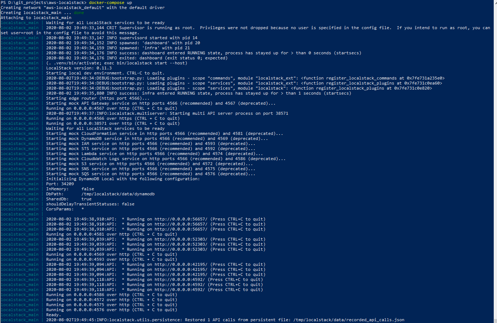

# Build my dockerized AWS Localstack <!-- omit in toc -->

## Sommaire <!-- omit in toc -->

- [1. Create docker-compose file](#1-create-docker-compose-file)
- [2. Set environment and start container](#2-set-environment-and-start-container)

## 1. Create docker-compose file

First i have to write docker-compose file from localstack repository
[localstack repository](https://github.com/localstack/localstack).

## 2. Set environment and start container

Write an .env file to set AWS localstack services to boot in environment variables and start docker container.
It is a more common way in order to set environment variables with [docker-compose](https://docs.docker.com/compose/environment-variables/#the-env-file).

*Start AWS localstack container*

        docker-compose up

*Results observed after starting up container*

